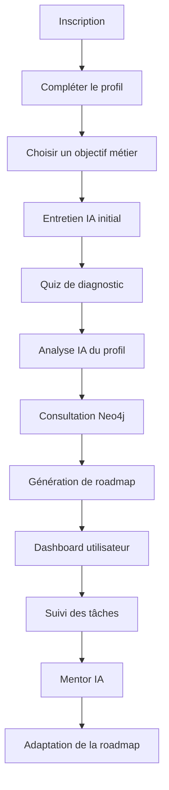
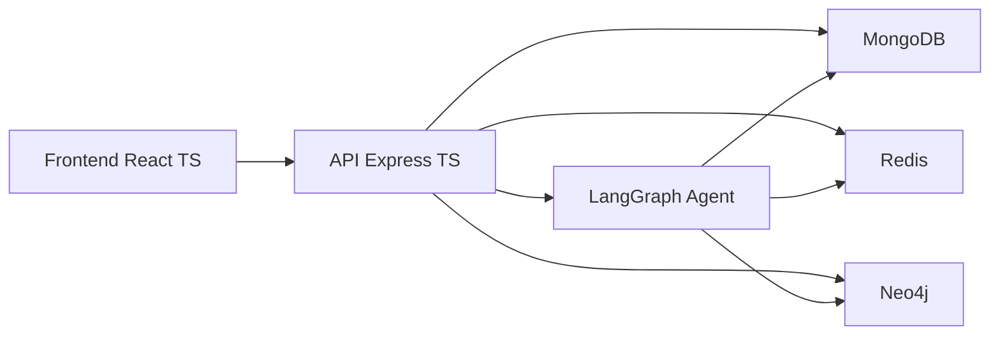
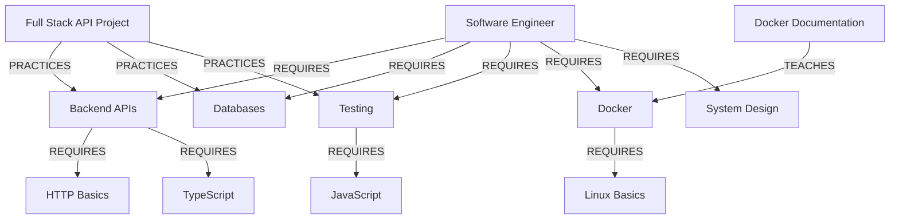
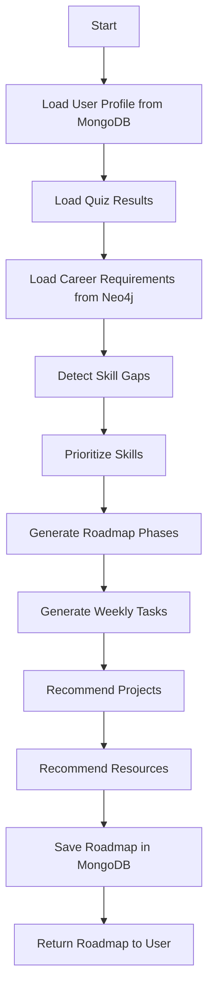
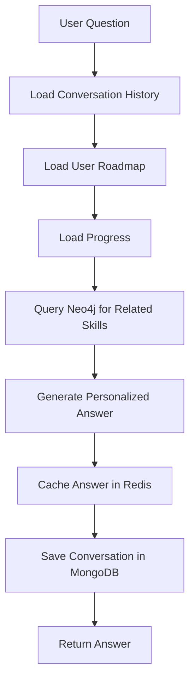
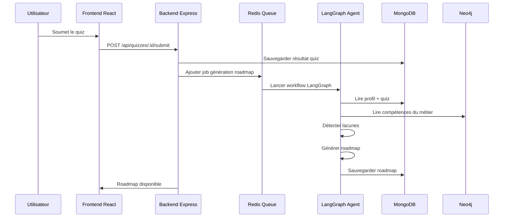
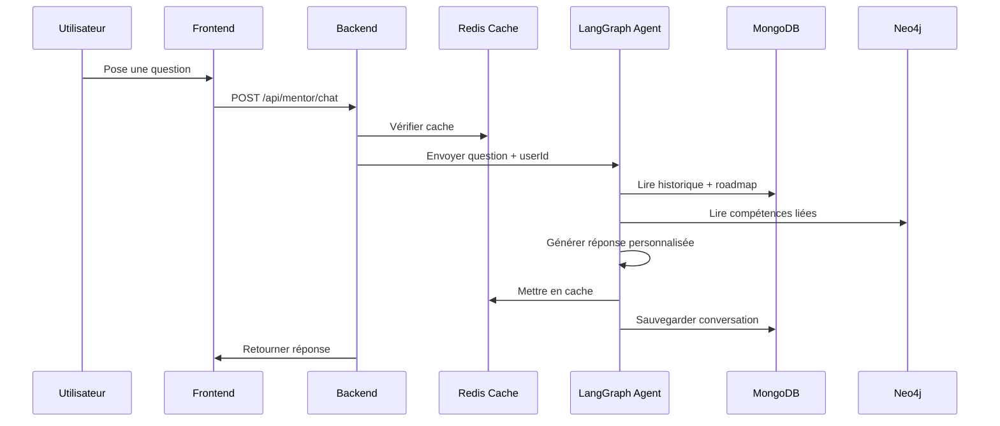

# Cahier des charges — PathMentor AI

## 1. Identification du projet

### 1.1 Nom du projet

**PathMentor AI**

### 1.2 Nature du projet

PathMentor AI est une application web intelligente destinée aux étudiants en informatique et aux jeunes développeurs. Elle permet d’orienter l’utilisateur vers un métier informatique précis, d’évaluer son niveau actuel, d’identifier ses lacunes, puis de générer une roadmap personnalisée avec des tâches, des projets, des ressources et un accompagnement par un mentor IA.

### 1.3 Domaine ciblé

L’application est limitée aux métiers de l’informatique afin de garder un graphe de compétences cohérent.

Métiers supportés :

- Software Engineer
- Frontend Developer
- Backend Developer
- Full Stack Developer
- Data Engineer
- Data Scientist
- AI Engineer
- MLOps Engineer
- DevOps Engineer
- Cloud Engineer
- Cybersecurity Analyst
- Mobile Developer
- Game Developer

---

## 2. Contexte et problématique

### 2.1 Contexte

Les étudiants en informatique ont accès à énormément de ressources : vidéos, documentations, cours en ligne, articles techniques, tutoriels et projets GitHub. Cette richesse devient parfois un problème, car l’étudiant ne sait pas toujours quoi apprendre, dans quel ordre apprendre, quelles compétences sont réellement nécessaires pour un métier, ou comment mesurer sa progression.

### 2.2 Problématique

La problématique principale est :

> Comment proposer à chaque étudiant un parcours d’apprentissage personnalisé, cohérent et évolutif vers un métier informatique cible ?

### 2.3 Solution proposée

PathMentor AI propose une plateforme combinant :

- un profil utilisateur ;
- un entretien IA initial ;
- un quiz de diagnostic ;
- un graphe de compétences ;
- une roadmap personnalisée ;
- un mentor IA conversationnel ;
- un suivi de progression.

L’objectif est de transformer un objectif vague comme :

> Je veux devenir Software Engineer

En plan concret :

> Semaine 1 : renforcer TypeScript  
> Semaine 2 : construire une API Express  
> Semaine 3 : apprendre MongoDB  
> Semaine 4 : intégrer Redis  
> Semaine 5 : créer un projet complet

---

## 3. Objectifs du projet

### 3.1 Objectif principal

Développer une application web intelligente capable de guider un étudiant en informatique vers un métier cible grâce à une roadmap personnalisée et un mentor IA.

### 3.2 Objectifs fonctionnels

L’application doit permettre de :

- créer un compte utilisateur ;
- définir un objectif de carrière ;
- passer un entretien IA initial ;
- passer un quiz de diagnostic ;
- analyser le niveau de l’utilisateur ;
- détecter les compétences maîtrisées et manquantes ;
- générer une roadmap personnalisée ;
- proposer des projets adaptés ;
- recommander des ressources d’apprentissage ;
- suivre la progression ;
- discuter avec un mentor IA ;
- adapter la roadmap au fil du temps.

### 3.3 Objectifs techniques

Le projet doit démontrer l’utilisation réelle de technologies modernes :

- React TypeScript pour le frontend ;
- Axios pour les appels API ;
- Express TypeScript pour le backend ;
- MongoDB comme base de données principale ;
- Redis pour le cache, les sessions et les queues ;
- Neo4j pour le graphe de connaissances ;
- LangGraph pour l’orchestration de l’agent IA.

---

## 4. Stack technique retenue

### 4.1 Frontend

- React
- TypeScript
- Tailwind CSS
- Axios
- React Router
- Optionnel : Zustand pour l’état global

### 4.2 Backend

- Node.js
- Express
- TypeScript
- JWT pour l’authentification
- Mongoose pour MongoDB
- Neo4j Driver
- Redis client
- BullMQ pour les files d’attente
- LangGraph pour les workflows IA

### 4.3 Bases de données

- MongoDB : base principale
- Redis : cache, sessions, queues
- Neo4j : base graphe

### 4.4 Technologies exclues

Le projet n’utilise pas :

- PostgreSQL
- MySQL
- Prisma
- base relationnelle classique

---

## 5. Justification des choix techniques

### 5.1 MongoDB

MongoDB est choisi comme base principale car l’application manipule beaucoup de données semi-structurées : profils utilisateurs, roadmaps, phases, tâches, résultats de quiz, conversations IA et recommandations.

Une roadmap peut contenir plusieurs phases, chaque phase peut contenir plusieurs tâches, et chaque tâche peut avoir ses propres ressources. Ce modèle s’adapte bien aux documents MongoDB.

### 5.2 Redis

Redis est utilisé pour :

- les sessions ;
- les refresh tokens ;
- le cache des réponses IA ;
- le cache des roadmaps ;
- le rate limiting ;
- les queues BullMQ ;
- l’état temporaire d’un workflow IA.

### 5.3 Neo4j

Neo4j est utilisé pour représenter les relations entre métiers, compétences, prérequis, projets et ressources.

Exemple :

```text
Software Engineer nécessite Backend APIs
Backend APIs nécessite HTTP Basics
Docker nécessite Linux Basics
Full Stack Project pratique React, Express et MongoDB
```

Ces relations sont plus naturelles dans une base graphe que dans une base documentaire simple.

### 5.4 LangGraph

LangGraph permet de créer un agent IA structuré. L’agent ne se contente pas de répondre à une question : il suit un workflow en plusieurs étapes, comme analyser le profil, consulter Neo4j, détecter les lacunes, générer une roadmap et sauvegarder les résultats.

---

## 6. Acteurs du système

### 6.1 Utilisateur étudiant

L’utilisateur étudiant peut :

- créer un compte ;
- compléter son profil ;
- choisir un objectif métier ;
- passer un entretien IA ;
- passer un quiz ;
- recevoir une roadmap ;
- suivre sa progression ;
- consulter ses ressources ;
- parler avec le mentor IA.

### 6.2 Administrateur

L’administrateur peut :

- gérer les métiers ;
- gérer les compétences ;
- gérer les ressources ;
- gérer les projets proposés ;
- gérer les questions de quiz ;
- consulter les statistiques globales.

### 6.3 Agent IA

L’agent IA est un acteur logique. Il peut :

- analyser un profil ;
- poser des questions ;
- détecter les compétences ;
- consulter Neo4j ;
- générer une roadmap ;
- recommander des projets ;
- répondre aux questions ;
- évaluer la progression.

---

## 7. Expérience utilisateur complète

### 7.1 Inscription

L’utilisateur crée un compte avec :

- nom complet ;
- email ;
- mot de passe ;
- niveau d’études ;
- domaine actuel ;
- temps disponible par semaine.

### 7.2 Onboarding

L’utilisateur choisit un objectif principal parmi les métiers proposés.

Exemple :

```text
Je veux devenir Software Engineer.
```

Il renseigne ensuite :

- son niveau actuel ;
- les technologies qu’il connaît ;
- les projets déjà réalisés ;
- son rythme d’apprentissage ;
- ses préférences d’apprentissage.

### 7.3 Entretien IA initial

Avant le quiz, l’agent IA pose quelques questions pour mieux comprendre l’utilisateur.

Exemples :

```text
As-tu déjà développé une application web complète ?
Connais-tu Git et GitHub ?
As-tu déjà travaillé avec une API ?
As-tu déjà utilisé Docker ?
Combien d’heures peux-tu étudier par semaine ?
```

### 7.4 Quiz de diagnostic

Le quiz évalue les compétences liées au métier choisi.

Pour Software Engineer, il peut couvrir :

- programmation ;
- Git ;
- frontend ;
- backend ;
- bases de données ;
- API ;
- tests ;
- Docker ;
- architecture ;
- system design.

### 7.5 Analyse du profil

Après le quiz, l’agent IA analyse :

- le profil utilisateur ;
- les réponses au quiz ;
- l’objectif métier ;
- les compétences déjà connues ;
- le graphe Neo4j ;
- les ressources disponibles.

Il produit :

- un résumé du profil ;
- les forces ;
- les lacunes ;
- le niveau estimé ;
- une roadmap recommandée.

### 7.6 Génération de roadmap

La roadmap est organisée en :

- phases ;
- semaines ;
- tâches ;
- projets ;
- ressources ;
- objectifs mesurables.

Exemple :

```text
Objectif : Software Engineer
Durée : 12 semaines

Phase 1 : Bases backend
Phase 2 : Bases de données et API
Phase 3 : Docker et déploiement
Phase 4 : Projet final
```

### 7.7 Suivi de progression

L’utilisateur peut marquer les tâches comme :

- non commencée ;
- en cours ;
- terminée ;
- bloquée.

Le système calcule :

- la progression globale ;
- la progression par compétence ;
- le temps restant estimé ;
- les prochaines recommandations.

### 7.8 Mentor IA

L’utilisateur peut poser des questions au mentor IA.

Exemples :

```text
Explique-moi Docker simplement.
Je ne comprends pas les API REST.
Quel projet dois-je faire cette semaine ?
Est-ce que je suis prêt pour un stage backend ?
```

Le mentor répond en tenant compte du profil, de la roadmap, de la progression, de l’historique de conversation et du graphe de compétences.

---

## 8. Diagramme du parcours utilisateur



---

## 9. Architecture globale



### 9.1 Explication

- Le frontend communique avec le backend via Axios.
- Le backend expose une API REST.
- MongoDB stocke les données principales.
- Redis accélère l’application et gère les queues.
- Neo4j stocke le graphe de connaissances.
- LangGraph orchestre l’agent IA.

---

## 10. Architecture frontend

### 10.1 Structure proposée

```text
frontend/
├── src/
│   ├── assets/
│   ├── components/
│   ├── layouts/
│   ├── pages/
│   │   ├── public/
│   │   ├── auth/
│   │   ├── onboarding/
│   │   ├── dashboard/
│   │   ├── quiz/
│   │   ├── roadmap/
│   │   ├── mentor/
│   │   └── admin/
│   ├── services/
│   ├── hooks/
│   ├── types/
│   ├── utils/
│   └── main.tsx
```

### 10.2 Pages principales

Pages publiques :

- Landing page
- Connexion
- Inscription
- Mot de passe oublié

Pages utilisateur :

- Dashboard
- Profil
- Onboarding
- Quiz
- Roadmap
- Tâches
- Ressources
- Chat mentor IA

Pages administrateur :

- Dashboard admin
- Gestion métiers
- Gestion compétences
- Gestion ressources
- Gestion quiz

---

## 11. Architecture backend

### 11.1 Structure proposée

```text
backend/
├── src/
│   ├── config/
│   ├── modules/
│   │   ├── auth/
│   │   ├── users/
│   │   ├── career-goals/
│   │   ├── quiz/
│   │   ├── roadmaps/
│   │   ├── skills/
│   │   ├── resources/
│   │   ├── mentor/
│   │   ├── admin/
│   │   └── ai/
│   ├── databases/
│   │   ├── mongodb.ts
│   │   ├── redis.ts
│   │   └── neo4j.ts
│   ├── middlewares/
│   ├── workers/
│   ├── queues/
│   ├── utils/
│   └── server.ts
```

### 11.2 Organisation d’un module

```text
module/
├── controller.ts
├── service.ts
├── model.ts
├── routes.ts
├── validation.ts
└── types.ts
```

---

## 12. Modélisation MongoDB

### 12.1 Collections principales

```text
users
profiles
career_goals
skills_catalog
quiz_templates
quiz_attempts
roadmaps
projects
resources
conversations
ai_profiles
notifications
```

### 12.2 Collection users

```json
{
  "_id": "ObjectId",
  "email": "zakaria@example.com",
  "passwordHash": "hashed_password",
  "role": "STUDENT",
  "createdAt": "2026-06-03T10:00:00Z",
  "lastLoginAt": "2026-06-03T11:00:00Z"
}
```

### 12.3 Collection profiles

```json
{
  "_id": "ObjectId",
  "userId": "ObjectId",
  "fullName": "Zakaria",
  "educationLevel": "Engineering student",
  "currentLevel": "Intermediate",
  "weeklyStudyHours": 6,
  "knownTechnologies": ["Vue.js", "SQL", "C++", "Linux basics"],
  "preferredLearningStyle": ["projects", "documentation"],
  "targetCareerId": "career_software_engineer"
}
```

### 12.4 Collection career_goals

```json
{
  "_id": "career_software_engineer",
  "name": "Software Engineer",
  "description": "Développe des systèmes logiciels fiables et maintenables.",
  "difficulty": "Intermediate",
  "estimatedDurationWeeks": 12,
  "domains": ["Programming", "Backend", "Databases", "DevOps", "System Design"]
}
```

### 12.5 Collection quiz_attempts

```json
{
  "_id": "ObjectId",
  "userId": "ObjectId",
  "careerGoalId": "career_software_engineer",
  "score": 62,
  "answers": [
    {
      "questionId": "q1",
      "skillTag": "REST APIs",
      "isCorrect": true
    },
    {
      "questionId": "q2",
      "skillTag": "Docker",
      "isCorrect": false
    }
  ],
  "strengths": ["JavaScript", "SQL"],
  "weaknesses": ["Docker", "Testing"],
  "completedAt": "2026-06-03T12:00:00Z"
}
```

### 12.6 Collection roadmaps

```json
{
  "_id": "ObjectId",
  "userId": "ObjectId",
  "careerGoalId": "career_software_engineer",
  "title": "Roadmap Software Engineer - 12 semaines",
  "status": "ACTIVE",
  "progressPercentage": 25,
  "phases": [
    {
      "title": "Backend Foundations",
      "order": 1,
      "tasks": [
        {
          "title": "Créer une API REST avec Express",
          "skill": "Backend APIs",
          "status": "DONE",
          "estimatedHours": 4
        },
        {
          "title": "Ajouter JWT authentication",
          "skill": "Authentication",
          "status": "IN_PROGRESS",
          "estimatedHours": 5
        }
      ]
    }
  ],
  "createdAt": "2026-06-03T13:00:00Z"
}
```

### 12.7 Collection conversations

```json
{
  "_id": "ObjectId",
  "userId": "ObjectId",
  "messages": [
    {
      "role": "user",
      "content": "Explique-moi Docker simplement.",
      "createdAt": "2026-06-03T15:00:00Z"
    },
    {
      "role": "assistant",
      "content": "Docker permet d'emballer une application avec son environnement...",
      "createdAt": "2026-06-03T15:00:05Z"
    }
  ]
}
```

### 12.8 Collection ai_profiles

```json
{
  "_id": "ObjectId",
  "userId": "ObjectId",
  "careerGoalId": "career_software_engineer",
  "summary": "L'utilisateur a de bonnes bases en développement web mais doit renforcer Docker, testing et architecture.",
  "detectedLevel": "Intermediate",
  "strengths": ["Frontend basics", "SQL", "Linux basics"],
  "gaps": ["Docker", "Testing", "System Design"],
  "recommendedFocus": ["Backend APIs", "Docker", "Testing"],
  "generatedAt": "2026-06-03T13:30:00Z"
}
```

---

## 13. Modélisation Neo4j

### 13.1 Nœuds

```text
Career
Skill
Domain
Project
Resource
Level
```

### 13.2 Relations

```text
(Career)-[:REQUIRES]->(Skill)
(Skill)-[:REQUIRES]->(Skill)
(Skill)-[:BELONGS_TO]->(Domain)
(Project)-[:PRACTICES]->(Skill)
(Resource)-[:TEACHES]->(Skill)
(Resource)-[:HAS_LEVEL]->(Level)
(Project)-[:HAS_LEVEL]->(Level)
```

### 13.3 Exemple de graphe



### 13.4 Utilisation de Neo4j

Neo4j permet de répondre à des questions comme :

```text
Quelles compétences sont nécessaires pour devenir Software Engineer ?
Quelles compétences dois-je apprendre avant Docker ?
Quels projets pratiquent MongoDB et Express ?
Quelles ressources enseignent les compétences manquantes ?
```

---

## 14. Redis

### 14.1 Utilisations principales

Redis sera utilisé pour :

- sessions ;
- refresh tokens ;
- cache des roadmaps ;
- cache des réponses IA ;
- rate limiting ;
- queues BullMQ ;
- notifications temporaires ;
- état temporaire des workflows IA.

### 14.2 Exemples de clés Redis

```text
session:user:123
refresh:user:123
rate_limit:ai:user:123
roadmap:cache:user:123
ai_answer:cache:hash123
queue:roadmap_generation
queue:mentor_response
```

### 14.3 Exemple d’usage

Quand un utilisateur demande une nouvelle roadmap, le backend ajoute une tâche dans Redis/BullMQ :

```text
queue:roadmap_generation
```

Un worker récupère la tâche et lance le workflow LangGraph.

---

## 15. LangGraph

### 15.1 Rôle de l’agent IA

L’agent IA doit être capable de :

- analyser le profil ;
- analyser les réponses au quiz ;
- consulter Neo4j ;
- détecter les lacunes ;
- générer une roadmap ;
- proposer des projets ;
- répondre aux questions ;
- adapter les recommandations.

### 15.2 Agents internes

Le système peut être composé de plusieurs agents logiques :

```text
Profile Analyzer Agent
Career Goal Agent
Skill Gap Agent
Roadmap Generator Agent
Project Recommender Agent
Resource Recommender Agent
Learning Mentor Agent
Progress Evaluator Agent
```

### 15.3 Workflow de génération de roadmap



### 15.4 Workflow du mentor IA



### 15.5 État LangGraph proposé

```ts
type RoadmapGenerationState = {
  userId: string;
  careerGoalId: string;
  userProfile?: {
    currentLevel: string;
    weeklyStudyHours: number;
    knownTechnologies: string[];
  };
  quizResults?: {
    score: number;
    strengths: string[];
    weaknesses: string[];
  };
  requiredSkills?: string[];
  missingSkills?: string[];
  prioritizedSkills?: string[];
  roadmap?: {
    title: string;
    phases: RoadmapPhase[];
  };
  recommendedProjects?: string[];
  recommendedResources?: string[];
};
```

---

## 16. API REST

### 16.1 Authentification

```text
POST /api/auth/register
POST /api/auth/login
POST /api/auth/logout
POST /api/auth/refresh-token
POST /api/auth/forgot-password
POST /api/auth/reset-password
```

### 16.2 Profil utilisateur

```text
GET    /api/users/me
PUT    /api/users/me
GET    /api/users/me/profile
PUT    /api/users/me/profile
```

### 16.3 Objectifs de carrière

```text
GET  /api/career-goals
GET  /api/career-goals/:id
POST /api/users/me/career-goal
```

### 16.4 Entretien IA

```text
POST /api/ai/interview/start
POST /api/ai/interview/answer
GET  /api/ai/interview/result
```

### 16.5 Quiz

```text
GET  /api/quizzes/:careerGoalId
POST /api/quizzes/:quizId/submit
GET  /api/users/me/quiz-attempts
```

### 16.6 Roadmap

```text
POST /api/roadmaps/generate
GET  /api/users/me/roadmap
GET  /api/roadmaps/:id
PUT  /api/roadmaps/:roadmapId/tasks/:taskId/status
POST /api/roadmaps/:id/regenerate
```

### 16.7 Mentor IA

```text
POST /api/mentor/chat
GET  /api/mentor/conversations
GET  /api/mentor/conversations/:id
```

### 16.8 Ressources et projets

```text
GET /api/resources
GET /api/resources/recommended
GET /api/projects/recommended
```

### 16.9 Administration

```text
POST   /api/admin/career-goals
PUT    /api/admin/career-goals/:id
DELETE /api/admin/career-goals/:id

POST   /api/admin/skills
PUT    /api/admin/skills/:id
DELETE /api/admin/skills/:id

POST   /api/admin/resources
PUT    /api/admin/resources/:id
DELETE /api/admin/resources/:id
```

---

## 17. Diagrammes de séquence

### 17.1 Génération d’une roadmap



### 17.2 Chat avec mentor IA



---

## 18. Règles de gestion

### 18.1 Utilisateur

- Un utilisateur possède un seul compte.
- Un utilisateur peut avoir un objectif principal actif.
- Un utilisateur peut changer d’objectif.
- Le changement d’objectif peut déclencher une nouvelle roadmap.
- Le quiz est obligatoire avant la première roadmap.

### 18.2 Roadmap

- Une roadmap appartient à un utilisateur.
- Une roadmap cible un métier précis.
- Une roadmap contient plusieurs phases.
- Une phase contient plusieurs tâches.
- Une tâche peut avoir les statuts : TODO, IN_PROGRESS, DONE, BLOCKED.
- La progression est recalculée après chaque mise à jour de tâche.

### 18.3 Agent IA

- L’agent ne remplace pas totalement l’utilisateur.
- Les recommandations importantes doivent être sauvegardées.
- Les réponses fréquentes peuvent être cachées.
- Les générations longues doivent passer par une queue.
- L’utilisateur peut demander une régénération de roadmap.

### 18.4 Administrateur

- L’administrateur peut gérer les données du graphe.
- L’administrateur peut ajouter des métiers, compétences et ressources.
- Les suppressions critiques doivent être confirmées.

---

## 19. User stories

### 19.1 Utilisateur

| ID | User story |
|---|---|
| US01 | En tant qu’utilisateur, je veux créer un compte afin d’accéder à mon espace personnel. |
| US02 | En tant qu’utilisateur, je veux choisir un métier cible afin de recevoir une roadmap adaptée. |
| US03 | En tant qu’utilisateur, je veux passer un quiz afin d’évaluer mon niveau. |
| US04 | En tant qu’utilisateur, je veux recevoir une roadmap afin de savoir quoi apprendre. |
| US05 | En tant qu’utilisateur, je veux suivre mes tâches afin de mesurer ma progression. |
| US06 | En tant qu’utilisateur, je veux parler avec un mentor IA afin d’obtenir de l’aide personnalisée. |
| US07 | En tant qu’utilisateur, je veux recevoir des projets recommandés afin de pratiquer. |

### 19.2 Administrateur

| ID | User story |
|---|---|
| US08 | En tant qu’administrateur, je veux gérer les métiers disponibles. |
| US09 | En tant qu’administrateur, je veux gérer les compétences du graphe. |
| US10 | En tant qu’administrateur, je veux ajouter des ressources. |
| US11 | En tant qu’administrateur, je veux consulter les statistiques générales. |

---

## 20. Exigences non fonctionnelles

### 20.1 Performance

- Le dashboard doit charger en moins de 3 secondes.
- Les réponses IA fréquentes doivent être mises en cache.
- Les traitements longs doivent être asynchrones.
- Les listes doivent être paginées.

### 20.2 Sécurité

- Les mots de passe doivent être hashés.
- L’authentification doit utiliser JWT.
- Les refresh tokens peuvent être stockés dans Redis.
- Les routes sensibles doivent être protégées.
- Le rate limiting doit limiter l’abus des appels IA.
- Les entrées doivent être validées côté backend.

### 20.3 Maintenabilité

- Le code doit être écrit en TypeScript.
- Le backend doit être modulaire.
- Les services doivent être séparés des contrôleurs.
- Les erreurs doivent être centralisées.
- Les variables sensibles doivent être dans un fichier `.env`.
- L’application doit pouvoir être lancée avec Docker Compose.

### 20.4 Scalabilité

- MongoDB peut évoluer horizontalement.
- Redis permet de gérer les queues.
- Les workers IA peuvent être séparés de l’API principale.
- Neo4j peut être optimisé avec des index sur les nœuds importants.

---

## 21. MVP

### 21.1 Fonctionnalités MVP

Le MVP doit inclure :

- inscription / connexion ;
- profil utilisateur ;
- choix d’un objectif métier ;
- entretien IA simple ;
- quiz diagnostic ;
- génération de roadmap ;
- affichage de roadmap ;
- suivi de tâches ;
- chat mentor IA simple ;
- stockage MongoDB ;
- graphe Neo4j basique ;
- cache ou queue Redis.

### 21.2 Métiers inclus dans le MVP

Pour simplifier la première version, le MVP peut inclure seulement :

- Software Engineer
- Frontend Developer
- Backend Developer
- Data Engineer
- DevOps Engineer

Les autres métiers peuvent être ajoutés en V2.

### 21.3 Graphe MVP

Le graphe MVP doit inclure :

- 5 métiers ;
- environ 40 compétences ;
- environ 20 ressources ;
- environ 10 projets ;
- relations prérequis entre compétences.

---

## 22. Version avancée V2

Fonctionnalités possibles :

- import CV ;
- analyse de profil GitHub ;
- génération de portfolio ;
- recommandations de stages ;
- badges et gamification ;
- notifications temps réel ;
- mode classe pour enseignants ;
- comparaison entre plusieurs métiers ;
- dashboard analytique avancé ;
- recherche vectorielle dans les ressources ;
- génération automatique de mini-exercices.

---

## 23. Planning prévisionnel

| Phase | Durée | Livrables |
|---|---:|---|
| Analyse et conception | 1 semaine | Cahier des charges, diagrammes |
| Setup technique | 1 semaine | React, Express, Docker, MongoDB, Redis, Neo4j |
| Backend core | 2 semaines | Auth, profil, objectifs, quiz |
| Frontend core | 2 semaines | Pages principales |
| Intégration IA | 2 semaines | LangGraph, mentor IA, roadmap |
| Intégration Neo4j | 1 semaine | Graphe métiers/compétences |
| Intégration Redis | 1 semaine | Cache, sessions, queues |
| Tests et amélioration | 1 semaine | Corrections, sécurité, UX |
| Présentation finale | 1 semaine | Démo, rapport, slides |

---

## 24. Critères de validation

Le projet sera considéré comme réussi si :

- l’utilisateur peut créer un compte ;
- l’utilisateur peut choisir un métier cible ;
- l’utilisateur peut passer un quiz ;
- l’IA peut générer une roadmap personnalisée ;
- la roadmap est stockée dans MongoDB ;
- les relations métiers-compétences sont stockées dans Neo4j ;
- Redis est utilisé pour le cache ou les queues ;
- le mentor IA peut répondre selon le profil utilisateur ;
- l’utilisateur peut suivre sa progression ;
- l’administrateur peut gérer au moins les métiers et compétences.

---

## 25. Conclusion

PathMentor AI est une application moderne qui combine développement web, bases NoSQL, graphe de connaissances et intelligence artificielle.

Le projet est intéressant car chaque technologie a un rôle clair :

- **MongoDB** sert de base principale flexible ;
- **Redis** améliore la rapidité et gère les traitements asynchrones ;
- **Neo4j** modélise les relations entre métiers, compétences et ressources ;
- **LangGraph** orchestre un agent IA structuré ;
- **React TypeScript** fournit une interface moderne ;
- **Express TypeScript** fournit une API robuste.

Ce projet est adapté à un contexte académique, mais il peut aussi être présenté comme une vraie idée de produit moderne pour l’orientation et l’apprentissage dans le domaine informatique.
